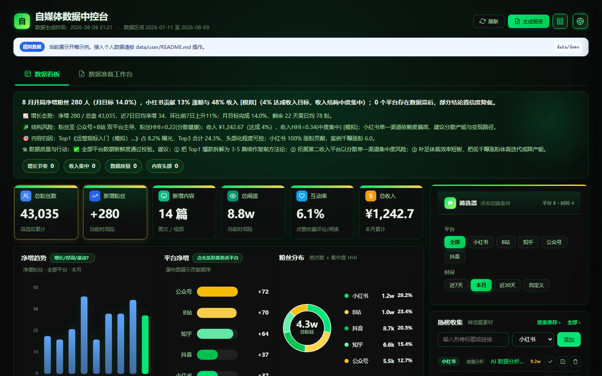
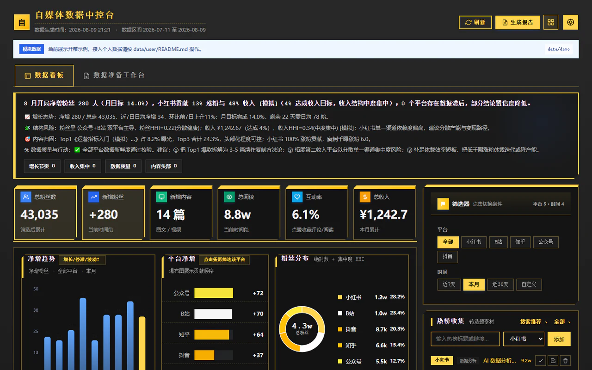

# 自媒体数据中控台

一个在 Windows 本地运行的自媒体经营工作台。下载后可以直接查看模拟数据成品；接入自己的小红书、抖音、知乎、B站或公众号数据时，把项目交给能够读取本地文件和执行命令的 AI，让 AI 完成配置、整理和校验。

项目严格隔离 `data/demo/` 与 `data/user/`，不包含知识星球数据，也不会把个人数据自动提交到 Git。

## 先看模拟数据成品

下载并完整解压项目后，双击根目录的 `open_console.bat`。浏览器打开后，页面顶部显示“模拟数据”和 `data/demo`，就说明项目已经可以使用。

如果双击后提示没有 Python，把提示截图发给 AI，让 AI 根据你的电脑环境继续指导。不要自己修改项目文件。

## 皮肤效果

### 翡翠矩阵



### 工业信标



页面右上角的主题按钮可以切换皮肤，选择结果会保存在当前浏览器。

## 让 AI 帮你接入个人数据

把解压后的项目文件夹作为工作区打开到支持本地文件和终端的 AI 编程工具，然后把下面整段提示词发给 AI。用户不需要自己编辑 JSON、创建数据目录或运行 Python 命令。

```text
请作为“自媒体数据中控台接入助手”，直接在当前项目中帮我完成个人数据接入，不要只给我命令或让我自己编辑配置文件。

开始前请先完整阅读：
- AGENTS.md
- README.md
- PERSONAL_SETUP_CHECKLIST.md
- data/README.md
- data/user/README.md
- docs/数据采集指南.md
- docs/自媒体看板字段映射对照表.md

你的任务：
1. 先检查项目、Python 环境和模拟数据能否正常启动；能安全执行的项目内操作直接执行。
2. 用普通中文逐项问我：使用哪些平台、每个平台的公开账号别名、看板展示名称，以及是否需要月度涨粉或收入目标。不要让我填写平台代码或 JSON 字段。
3. 根据我的回答，从 config.example.json 生成仅保存在本机的 config.json，切换到 user 模式，并创建对应的 data/user 平台目录。
4. 只向我提供已启用平台的官方创作者后台网址，并告诉我需要导出哪些数据。登录、扫码、验证码和最终点击导出由我本人完成；不要索取或保存密码、Cookie、验证码、token、浏览器 Profile 或登录态。
5. 我导出后，可以把文件拖进对话，或告诉你文件的完整路径。只有拿到我明确提供的文件或目录路径后，才检查文件并按项目规范整理到 data/user；不要扫描无关的个人目录。
6. 检查文件类型和字段。如果缺少数据，用“平台 + 后台入口 + 缺少的导出项”告诉我，不要用内部字段名让我猜。
7. 需要安装项目依赖时先说明用途；得到允许后再安装。随后直接运行规范化、契约校验、紧凑数据生成和启动流程。
8. 只有个人数据契约通过后才切换个人看板；不得把 data/demo 与 data/user 混合。
9. 最后运行隐私检查，并用中文汇报：已接入平台、使用的数据文件、仍缺少的数据、看板是否成功、个人数据保存位置。不要提交 config.json 或 data/user 中的个人文件到 Git。

如果我还没有准备好信息，请先一次只问一个最容易回答的问题，从“你想接入哪些平台？”开始。
```

AI 最终应直接完成配置和脚本执行。用户只需要回答问题、本人登录平台后台，以及把下载好的文件交给 AI。

## 各平台官方后台

先告诉 AI 你使用哪些平台。AI 只应让你进入对应后台，不应要求你理解项目内部的平台代码。

| 平台 | 官方创作者后台 | 用户在后台需要导出 | 导出后交给 AI |
| --- | --- | --- | --- |
| 小红书 | [小红书创作服务平台](https://creator.xiaohongshu.com/) | 账号概览、涨粉数据、内容分析；有店铺时再导出商家经营数据 | `.xlsx`、`.csv` 或后台原始导出文件 |
| 抖音 | [抖音创作者中心](https://creator.douyin.com/) | 运营数据、作品数据；有需要时再导出主页数据 | 后台原始导出文件 |
| B站 | [B站创作中心](https://member.bilibili.com/) | 粉丝数据、播放与互动数据；需要收入时再导出商品销售数据 | `.xlsx`、`.csv` 或后台原始导出文件 |
| 知乎 | [知乎创作中心](https://www.zhihu.com/creator) | 关注者数据、内容数据 | `.xls` 或后台原始导出文件 |
| 公众号 | [微信公众平台](https://mp.weixin.qq.com/) | 用户分析、内容分析或文章统计 | `.csv`、`.json` 或后台原始导出文件 |

后台菜单名称可能随平台升级而变化。找不到对应入口时，把当前页面截图发给 AI，让 AI 根据页面继续指导；不要把账号密码或验证码发给 AI。

## AI 会向你询问什么

AI 只需要下面这些业务信息，不需要真实身份资料：

- 你使用的平台，例如“小红书和B站”。
- 每个平台用于建立文件夹的公开昵称或自定义别名。
- 看板上希望显示的名称。
- 可选的月度净增粉丝目标和收入目标。
- 已下载数据文件的附件，或你明确提供的文件完整路径。

如果暂时没有目标，直接回答“没有”；如果还没有导出文件，回答“请先告诉我去哪个后台导出什么”。完整对话清单见 [`PERSONAL_SETUP_CHECKLIST.md`](PERSONAL_SETUP_CHECKLIST.md)。

## AI 完成后的结果

AI 应完成并向你确认：

1. 个人配置已写入本机的 `config.json`。
2. 导出文件已按平台整理到 `data/user/`，或整理到你明确指定的外部授权目录。
3. Python 数据处理、契约校验和看板生成已经运行。
4. 页面顶部显示“个人数据”和 `data/user`，不再显示“模拟数据”。
5. 缺失或无法识别的数据已按平台说明，没有静默补零或混入模拟数据。
6. 隐私检查通过，个人文件没有进入 Git 提交范围。

## 隐私边界

- 登录、扫码、验证码和导出确认由用户本人完成。
- 不向 AI 提供密码、Cookie、验证码、浏览器 Profile、平台登录态、token 或 SSH 密钥。
- AI 只有在用户给出明确文件或目录路径后，才能读取并整理导出文件。
- `config.json` 和 `data/user/` 中的业务文件默认被 Git 忽略。
- 项目 Agent 不得在个人数据不完整时回退混用模拟数据。

<details>
<summary>仅供开发者和 AI：项目验证命令</summary>

```powershell
pip install -r requirements.txt
python scripts\normalize-self-media-dashboard.py
python scripts\check-self-media-dashboard-contract.py --console-root .
python scripts\build_compact_dashboard.py
python scripts\launch_console.py
python tests\test_portable_setup.py
python scripts\check_public_safety.py
```

完整脚本说明见 [`scripts/README.md`](scripts/README.md)，数据结构见 [`data/README.md`](data/README.md)。

</details>

## 贡献与许可

贡献说明见 [`CONTRIBUTING.md`](CONTRIBUTING.md)，发布前检查见 [`PUBLICATION_CHECKLIST.md`](PUBLICATION_CHECKLIST.md)。

本项目使用 [MIT License](LICENSE)。
